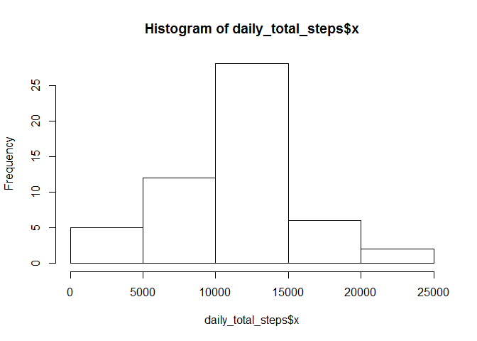

# Reproducible Research: Peer Assessment 1


## Background

### Original Documentation

The instructions and data for this assignment were forked from 

https://github.com/rdpeng/RepData_PeerAssessment1  

and placed in my local repo: PeerAssessment1


## Loading and preprocessing the data


```r
setwd("C:/Users/Brian/Documents/PeerAssessment1")
unzip("activity.zip")
data <- read.csv(file = "activity.csv", header = TRUE)
# Check the contents of the data file.
str(data)
```

```
## 'data.frame':	17568 obs. of  3 variables:
##  $ steps   : int  NA NA NA NA NA NA NA NA NA NA ...
##  $ date    : Factor w/ 61 levels "2012-10-01","2012-10-02",..: 1 1 1 1 1 1 1 1 1 1 ...
##  $ interval: int  0 5 10 15 20 25 30 35 40 45 ...
```

```r
sum(!is.na(data$steps))#Steps recorded as anticipated
```

```
## [1] 15264
```

```r
sum((!is.na(data$steps)) & (data$steps == 0))#Zero Steps recorded
```

```
## [1] 11014
```

```r
sum(is.na(data$steps))#NA
```

```
## [1] 2304
```

```r
#Check the other 2 variables for NA's
data[is.na(data$date),]
```

```
## [1] steps    date     interval
## <0 rows> (or 0-length row.names)
```

```r
data[is.na(data$interval),]
```

```
## [1] steps    date     interval
## <0 rows> (or 0-length row.names)
```


## What is mean total number of steps taken per day?

For this part of the assignment, you can ignore the missing values in the dataset.


```r
data2 <- data[!is.na(data$steps),] #Remove the rows with $steps == NA
dim(data2) #Check that only NA's are removed
```

```
## [1] 15264     3
```

```r
#Count the total steps for each day for the histogram
daily_total_steps <- aggregate(data2$steps, by=list(data2$date), FUN=sum)
hist(daily_total_steps$x)
```

 

## What is the average daily activity pattern?


## Imputing missing values


```r
#Check to see if all the NA's were on the one day
count_days <- levels(data$date)
length(count_days)
```

```
## [1] 61
```

```r
count2_days <- levels(data2$date)
length(count2_days)
```

```
## [1] 61
```

## Are there differences in activity patterns between weekdays and weekends?


## Software

This document was created using:
  
  RStudio  Version 0.98.953 - © 2009-2013 RStudio, Inc.
  
  knitr Version 1.6
