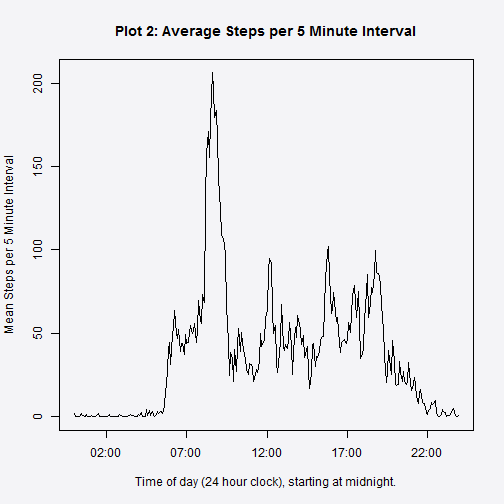

# Reproducible Research: Peer Assessment 1

## Background

### Embargo

These are the notes of my exploration of the raw data.  They are clearly not suitable for publication to any audience not familiar with the R language and the general approach to data exploration, employed in this context.  They simply form a complete record of my exploration and as such they do not elucidate this particular dataset and its implications all that clearly.  However, these transformations of the data form the foundations for the preparation of a publishable report.

### Original Documentation

The instructions and data for this assignment were forked from 

https://github.com/rdpeng/RepData_PeerAssessment1  

and placed in my local repo: PeerAssessment1

At the conclusion of these steps, the new repo was pushed back to GitHub, from where it can now be forked.

## Functions

The following functions were developed for this assignment but are available for use elsewhere.

##### This function will return the day of the week for a given date

```r
what_day <- function(date){
  date <- as.POSIXlt(date,format="%Y-%m-%d")
  wday <- weekdays(date)
}
#data$day <- sapply(data$date, what_day)#Uncomment to test this function.
```
##### This function will adjust the interval minutes to decimal fraction of an hour.

```r
dec_mins <- function(x){
  hours <- floor(x/100) 
  mins <- (x %% 100)*100/60
  y <- as.integer(round(100*hours + mins))
  }
```

##### This function replaces missing $intervals with the average for that day/interval.

It will be used later in the assignment to impute missing $steps data.

```r
lookup_steps <- function(average_steps, missing_days){
  ii <- dim(missing_days)
  i <- ii[1]
  for(n in 1:i){
    day <- missing_days[n, "day"]
    interval <- missing_days[n, "interval"]
    missing_days[n, "steps"] <- average_steps[(average_steps$day==day)
                                  &(average_steps$interval==interval), "steps"]
    next
  }
  return(missing_days)
}
```

## Loading and preprocessing the data


```r
#setwd("C:/Users/Brian/Documents/PeerAssessment1")#Set WD to local repo.
unzip("activity.zip")#leaves the data file in the WD.
data <- read.csv(file = "activity.csv", header = TRUE)
```
### Check the contents of the data file.

#### Code


```r
str(data)
```

```
## 'data.frame':	17568 obs. of  3 variables:
##  $ steps   : int  NA NA NA NA NA NA NA NA NA NA ...
##  $ date    : Factor w/ 61 levels "2012-10-01","2012-10-02",..: 1 1 1 1 1 1 1 1 1 1 ...
##  $ interval: int  0 5 10 15 20 25 30 35 40 45 ...
```

```r
summary(data)
```

```
##      steps               date          interval   
##  Min.   :  0.0   2012-10-01:  288   Min.   :   0  
##  1st Qu.:  0.0   2012-10-02:  288   1st Qu.: 589  
##  Median :  0.0   2012-10-03:  288   Median :1178  
##  Mean   : 37.4   2012-10-04:  288   Mean   :1178  
##  3rd Qu.: 12.0   2012-10-05:  288   3rd Qu.:1766  
##  Max.   :806.0   2012-10-06:  288   Max.   :2355  
##  NA's   :2304    (Other)   :15840
```

```r
d <<- dim(data)
d
```

```
## [1] 17568     3
```

```r
c1 <<- sum(!is.na(data$steps))#Steps recorded as anticipated
c1
```

```
## [1] 15264
```

```r
c2 <<- sum((!is.na(data$steps)) & (data$steps == 0))#Zero Steps recorded
c2
```

```
## [1] 11014
```

```r
c3 <<- sum(is.na(data$steps))#NA
c3
```

```
## [1] 2304
```

#### Commentary

The above code shows that the raw data is a dataframe composed of 17568 observations of 3 variables.

* $steps    (integer)the number of steps taken in that interval 
* $date     (character factor)the date of the recording
* $interval (integer)the time of the recording in 5 minute intervals (hhmm)

The dataframe contains 15264 complete records, 11014 of which recorded 0 steps.
A further 2304 records have missing data ($steps == NA) which is interpreted to mean that the device was malfunctioning at these intervals.

### Is there a pattern to the missing data?

#### Code


```r
#Check the other 2 variables for NA's
data[is.na(data$date),]
```

```
## [1] steps    date     interval
## <0 rows> (or 0-length row.names)
```

```r
data[is.na(data$interval),]
```

```
## [1] steps    date     interval
## <0 rows> (or 0-length row.names)
```

```r
#We appear to have 61 complete days of 288 * 5 minute intervals.
e1 <<- c1/288
#So, we have 8 complete days of missing $steps == NA
missingdays <- (data[is.na(data$steps),"date"])
length(missingdays)
```

```
## [1] 2304
```

```r
a1 <- length(unique(missingdays))
e3 <<- c3/288
#This leaves us with 53*288 intervals of zero and non-zero data
dim(data[!is.na(data$steps),])
```

```
## [1] 15264     3
```

```r
53*288
```

```
## [1] 15264
```

#### Commentary

The above manipulations helped to better understand the overall shape of the data.\n
It demonstrates that:

1. All the missing NA's are contained in $steps variable.
2. There are 53 complete days, each with 288*5 minute intervals.
3. And there are 8 missing days, each with 288*5 minute intervals.

##### How many complete days do we have?

#### Code


```r
complete_days <- data[!is.na(data$steps),]#Reduces the dataset to $steps==NA
complete_days <- complete_days[complete_days$interval==0,]#Reduces the dataset to 8 days
table(complete_days$day)#Shows how many complete days on each day of the week.
```

```
## < table of extent 0 >
```

##### Which days of the week are missing?.


```r
data$day <- sapply(data$date, what_day)
data$day <- ordered(data$day, levels = c("Monday", "Tuesday", "Wednesday", "Thursday", 
                                           "Friday", "Saturday", "Sunday"))
missing_days <- data[is.na(data$steps),]#Reduces the dataset to $steps==NA
missing_days <- missing_days[missing_days$interval==0,]#Reduces the dataset to 8 days
table(missing_days$day)#Shows how many missing days on each day of the week.
```

```
## 
##    Monday   Tuesday Wednesday  Thursday    Friday  Saturday    Sunday 
##         2         0         1         1         2         1         1
```

#### Commentary

The above code shows that both the complete and the missing days are spread evenly throughout the days of the week.

## What is the mean total number of steps taken per day?

For this part of the assignment, you can ignore the missing values in the dataset.

### Make a histogram of the total number of steps taken each day.


```r
data2 <- data[!is.na(data$steps),] #Remove the rows with $steps == NA
dim(data2) #Confirm that only NA's are removed
```

```
## [1] 15264     4
```

```r
length(unique(data2$date)) #Confirm the number of days of complete data (see previous calculation)
```

```
## [1] 53
```

```r
str(data2)
```

```
## 'data.frame':	15264 obs. of  4 variables:
##  $ steps   : int  0 0 0 0 0 0 0 0 0 0 ...
##  $ date    : Factor w/ 61 levels "2012-10-01","2012-10-02",..: 2 2 2 2 2 2 2 2 2 2 ...
##  $ interval: int  0 5 10 15 20 25 30 35 40 45 ...
##  $ day     : Ord.factor w/ 7 levels "Monday"<"Tuesday"<..: 2 2 2 2 2 2 2 2 2 2 ...
```

```r
#Count the total steps for each day for the histogram
daily_total_steps <- aggregate(data2$steps, by=list(data2$date), FUN=sum)
png("C:/Users/Brian/Documents/PeerAssessment1/figure/hist1.png")
hist(daily_total_steps$x, ylim=c(0, 20), 
     main = "Histogram of Each Day's Total Daily Steps", breaks = 10,
      xlab = "Total Number of Steps on a Given Day", 
      ylab = "Number of Days", labels = TRUE)
dev.off()
```

 

```
## RStudioGD 
##         2
```
### Calculate and report the mean and median total number of steps taken per day.

#### Commentary

The question is ambiguous, so I have experimented with two approaches.  The first one mnakes the most sense to me.  I have commented out the second approach, which produces a long array of zeroes, for no real purpose.

#### Code

##### Mean/Median of the daily totals


```r
summary(daily_total_steps$x) #simple way to do it.
```

```
##    Min. 1st Qu.  Median    Mean 3rd Qu.    Max. 
##      41    8840   10800   10800   13300   21200
```
##### Daily Mean/Median of steps taken in each interval.


```r
#remove the comments to run the code.
#daily_mean_steps <- aggregate(data2$steps, by=list(data2$date), FUN=mean)
#daily_median_steps <- aggregate(data2$steps, by=list(data2$date), FUN=median)
#report <- data.frame(date = daily_mean_steps$Group.1, mean = daily_mean_steps$x, 
#median = daily_median_steps$x)
#report
```

## What is the average daily activity pattern?

#### Commentary
The dec_mins function constructed up in the Functions section of this document was used to rid the plot of the gaps between the 55th and the 60th minute of each hour.

#### Code

```r
###Make a time series plot (i.e. type = "l") of the 5-minute interval (x-axis) and the average number of steps taken, averaged across all days (y-axis)

data3 <- data[!is.na(data$steps),]
data3$interval <- sapply(data3$interval, dec_mins)#convert minutes to a decimal

library(ggplot2)
data3$interval <- data3$interval/100
data3$steps <- data3$steps/5
interval_mean_steps <- aggregate(data3$steps, by=list(data3$interval), FUN=mean)
png("C:/Users/Brian/Documents/PeerAssessment1/figure/plot2.png")
p <- plot(interval_mean_steps, type = "l", xaxp = c(0, 24, 4),
    xlab = "Time of day (24 hour clock), starting at midnight.",
    ylab = "Average number of steps per minute.",
    main = "Average activity level across the day (Steps per minute.)")
p
```

```
## NULL
```

```r
dev.off()
```

 

```
## RStudioGD 
##         2
```

## Imputing missing values

#### Commentary

As shown above, the missing days are distributed evenly between the weekdays (6) and the weekends (2).  So it was decided to impute the missing values by calculating the mean for a given interval on a given day of the week and to insert that mean into the same missing day/interval.

#### Code


```r
complete_data <- data[!is.na(data$steps),] #Remove the rows with $steps == NA
average_steps <- aggregate(complete_data$steps, by=list(complete_data$day, complete_data$interval),
                           FUN=mean)
names(average_steps) <- c("day", "interval", "steps")
average_steps$steps <- as.integer(round(average_steps$steps))

missing_days <- data[is.na(data$steps),]#select the records with missing $steps == NA
fixed_missing_days <- lookup_steps(average_steps, missing_days)# ref: Functions section this report

fixed_data <- rbind(complete_data, fixed_missing_days)
#check for missing $steps
fixed_data[is.na(fixed_data$steps),]
```

```
## [1] steps    date     interval day     
## <0 rows> (or 0-length row.names)
```

## Are there differences in activity patterns between weekdays and weekends?

#### Commentary

As with the previous plot, the gaps had to be removed at the ends of each hour. 

The comparison between the week days and the weekends shows a reasonably predictable cultural pattern of an early morning walk or jog followed by a mainly sedentary lifestyle during the rest of the working day.  On the weekend, there is a higher average level of activity across the days, consistent with weekend leisure activities.

#### Code


```r
data4 <- data[!is.na(data$steps),]#remove the missing $steps == NA
#Convert minutes to 100ths of an hour to remove gaps in plot between 55 an 60 minutes.
data4$interval <- sapply(data4$interval, dec_mins)#See dec_mins()in Functions
date <- as.POSIXlt(data4$date,format="%Y-%m-%d")#Convert $date to DATE format
head(date)
```

```
## [1] "2012-10-02 EST" "2012-10-02 EST" "2012-10-02 EST" "2012-10-02 EST"
## [5] "2012-10-02 EST" "2012-10-02 EST"
```

```r
head(date$wday)
```

```
## [1] 2 2 2 2 2 2
```

```r
wdays <- (weekdays(date))
wdays <- data.frame(day = wdays, interval = data4$interval, steps = data4$steps)
head(wdays)
```

```
##       day interval steps
## 1 Tuesday        0     0
## 2 Tuesday        8     0
## 3 Tuesday       17     0
## 4 Tuesday       25     0
## 5 Tuesday       33     0
## 6 Tuesday       42     0
```

```r
weekends <- wdays[(wdays$day == "Saturday")|(wdays$day == "Sunday"), c("interval", "steps")]
weekdays <- wdays[!((wdays$day == "Saturday")|(wdays$day == "Sunday")), c("interval", "steps")]
weekend_mean_steps <- aggregate(weekends$steps, by=list(weekends$interval), FUN=mean)
weekday_mean_steps <- aggregate(weekdays$steps, by=list(weekdays$interval), FUN=mean)
weekend.df <- data.frame(day = "weekend", interval = weekend_mean_steps$Group.1, steps = weekend_mean_steps$x)
weekday.df <- data.frame(day = "weekday", interval = weekday_mean_steps$Group.1, steps = weekday_mean_steps$x)
combined.df <- rbind(weekend.df, weekday.df)
combined.df$interval <- combined.df$interval/100
library(lattice)
combined_plot <- xyplot(steps ~ interval | day , data=combined.df, type = "l", layout = c(1,2),
  xlab = "Time of day (24 hour clock), starting at midnight.",
  ylab = "Average number of steps per minute.",
  main = "Comparing average activity levels across the day\n on Weekdays and Weekends.")
trellis.device(device = "png", file = "C:/Users/Brian/Documents/PeerAssessment1/figure/combined_plot.png")
print(combined_plot)#, "C:/Users/Brian/Documents/PeerAssessment1/figure/combined_plot.png")
dev.off()
```

 

```
## RStudioGD 
##         2
```

## Software

This document was created using:
  
  RStudio  Version 0.98.953 - © 2009-2013 RStudio, Inc.
  
  knitr Version 1.6
  
  the knit2html package was loaded separately into the console.
    #library(knitr)
    #knit2html(input = "C:/Users/Brian/Documents/PeerAssessment1/PA1_template.Rmd", 
    #       output = "C:/Users/Brian/Documents/PeerAssessment1/PA1_template.md")
    
  git gui V 1.9.4 on W7 was used to push this document to the remote repo.
  
###### Work completed in September, 2013.
