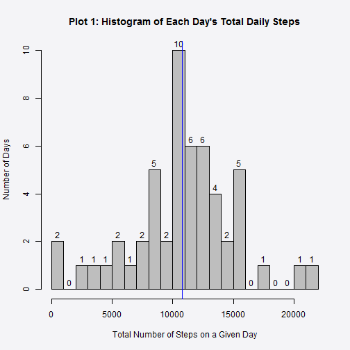
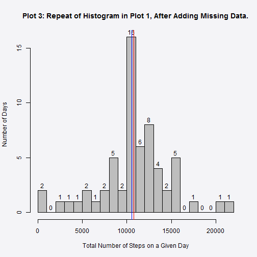
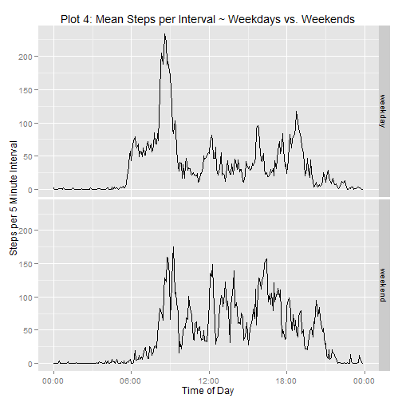

# Reproducible Research: Peer Assessment 1

### Notes for the Peer Reviewer

Thank you for reviewing my work.

The most suitable document for reading in Github is **PA1_template.MD**. In my local browser, I was able to use the .html file, which only displays source code Github. The original .RMD was created in RStudio as was the following code which was used, external to this document, to produce the output files from the RMD file:<br/>
&nbsp;&nbsp;&nbsp;&nbsp;&nbsp;&nbsp;&nbsp;&nbsp;&nbsp;&nbsp;&nbsp;&nbsp;library(knitr)<br/>
&nbsp;&nbsp;&nbsp;&nbsp;&nbsp;&nbsp;&nbsp;&nbsp;&nbsp;&nbsp;&nbsp;&nbsp;setwd('~/PeerAssessment1')<br/>
&nbsp;&nbsp;&nbsp;&nbsp;&nbsp;&nbsp;&nbsp;&nbsp;&nbsp;&nbsp;&nbsp;&nbsp;knit2html(input = 'PA1_template.Rmd')

### Project Background

The instructions and data for this project were forked from https://github.com/rdpeng/RepData_PeerAssessment1  
and placed in my local repo: https://github.com/bcanute/RepData_PeerAssessment1.  I then cloned this site to my local machine at C:/Users/Brian/Documents/PeerAssessment1/, which I set as my working directory in RStudio.

It is now possible to collect a large amount of data about personal movement using activity monitoring devices such as a Fitbit, Nike Fuelband, or Jawbone Up.

These types of devices are part of the "quantified self movement"– a group of enthusiasts who take measurements about themselves regularly to improve their health, to find patterns in their behavior, or simply because they are tech geeks. However, these data remain under-utilized both because the raw data are hard to obtain and there is a lack of statistical methods and software for processing and interpretting the data.

This project makes use of data from recorded with a personal activity monitoring device. This device collects data at 5 minute intervals throughout the day. The data consists of two months of data from an anonymous individual collected during the months of October and November, 2012 and includes the number of steps taken in 5 minute intervals each day.

### Initial Setup

The following packages are required to process this document and its data.


```r
library(knitr)
library(stringr)
library(lubridate)
library(reshape2)
library(ggplot2)
library(scales)
library(markdown)
opts_chunk$set(options(scipen = 6, digits = 2))
```

### Locate and Store the Data File

If the data file fails to appear in the forked assignment, it can be downloaded from this site (fileurl in the code.)  The following code will locate the data file on the net, download it, unzip it and store it as activity.csv file in the project's working directory.


```r
if (!file.exists("activity.zip")) {  
  fileurl = "https://d396qusza40orc.cloudfront.net/repdata%2Fdata%2Factivity.zip"
  download.file(fileurl, destfile = "activity.zip")
  unzip("activity.zip")
}
```

## Loading and preprocessing the data

Once the raw data has been downloaded and unzipped it can be loaded more conveniently from here.


```r
data.raw <- read.csv(file = "activity.csv", header = TRUE)
```
### Check the contents of the data file.

The following functions are useful for a routine inspection of the raw dataset.


```r
str(data.raw)
```

```
## 'data.frame':	17568 obs. of  3 variables:
##  $ steps   : int  NA NA NA NA NA NA NA NA NA NA ...
##  $ date    : Factor w/ 61 levels "2012-10-01","2012-10-02",..: 1 1 1 1 1 1 1 1 1 1 ...
##  $ interval: int  0 5 10 15 20 25 30 35 40 45 ...
```

```r
summary(data.raw)
```

```
##      steps              date          interval   
##  Min.   :  0    2012-10-01:  288   Min.   :   0  
##  1st Qu.:  0    2012-10-02:  288   1st Qu.: 589  
##  Median :  0    2012-10-03:  288   Median :1178  
##  Mean   : 37    2012-10-04:  288   Mean   :1178  
##  3rd Qu.: 12    2012-10-05:  288   3rd Qu.:1766  
##  Max.   :806    2012-10-06:  288   Max.   :2355  
##  NA's   :2304   (Other)   :15840
```

```r
names(data.raw)
```

```
## [1] "steps"    "date"     "interval"
```

```r
head(data.raw)
```

```
##   steps       date interval
## 1    NA 2012-10-01        0
## 2    NA 2012-10-01        5
## 3    NA 2012-10-01       10
## 4    NA 2012-10-01       15
## 5    NA 2012-10-01       20
## 6    NA 2012-10-01       25
```

The dataset is composed of 17568 observations of 3 variables.

**The 3 variables are:**

* $steps    (integer)the number of steps taken in that interval 
* $date     (character factor)the date of the recording
* $interval (integer)the time of the recording in 5 minute intervals, equivalent to hhmm.

**Missing Data ($steps==NA)**

15264 records are complete and 2304 records failed to record the number of steps taken in that period, presumably because the device failed to operate.

### Tidy the Data

Each $interval variable represents a 5 minute period of measurement within 24 hour day.  So, the $intervals prior to 1000 must be converted into  four digit Posixct format, by inserting leading 0's.

I have also created a fourth variable, $iposixct, which converts $date + $interval into date format, for later use in the assignment.


```r
data.tidy  <- data.raw
data.tidy$interval <- str_pad(data.tidy$interval, width = 4, pad = "0") 
data.tidy$iposixct <- paste(data.tidy$date, data.tidy$interval)          
data.tidy$iposixct <- parse_date_time(data.tidy$iposixct, "ymd HM")

data.missing <- data.tidy[!complete.cases(data.raw),]  
data.complete <- data.tidy[complete.cases(data.raw),]  
```
**Zero Activity ($steps==0)**

It should be noted that a large number of intervals (n = 11014) recorded 0 steps, indicating that the subject was inactive, although the machine was working.
    
## Make a histogram of the total number of steps taken each day.

The project instructions state that for this part of the assignment, you can ignore the missing values in the dataset.

    1. Make a histogram of the total number of steps taken each day

    2. Calculate and report the mean and median total number of steps taken per day


```r
data1 <- data.complete#ignore the missing records.
#recast the data to show the total steps taken on each day.
    data1melt <- melt(data1, id.vars = "date", measure.vars="steps" ) 
    data1cast <- dcast(data1melt, date ~ variable, fun.aggregate = sum)

## create the histogram of the daily total steps taken
    par(bg = "#F4F4F7")
    hist(data1cast$steps, main = "Plot 1: Histogram of Each Day's Total Daily Steps",
         xlab = "Total Number of Steps on a Given Day", breaks = 20, col = "gray",
         ylab= "Number of Days", labels = TRUE)
    abline(v=mean(data1cast$steps),col='red')
    abline(v=median(data1cast$steps),col='blue')
```

 

### Calculate and report the mean and median total number of steps taken per day.


```r
summary(data1cast$steps) #simple way to do it.
```

```
##    Min. 1st Qu.  Median    Mean 3rd Qu.    Max. 
##      41    8840   10800   10800   13300   21200
```

```r
str(data1cast)
```

```
## 'data.frame':	53 obs. of  2 variables:
##  $ date : Factor w/ 61 levels "2012-10-01","2012-10-02",..: 2 3 4 5 6 7 9 10 11 12 ...
##  $ steps: int  126 11352 12116 13294 15420 11015 12811 9900 10304 17382 ...
```

**The mean (10766.19) and the median (10765) are virtually identical.**  The mean (red) and median (blue) are shown on the above histogram.  Because the two values are virtually coincident with each other, the blue median overlays the red mean.

## What is the average daily activity pattern?

The project instructions call for a time series plot (i.e. type = "l") of the 5-minute interval (x-axis) and the average number of steps taken, averaged across all days (y-axis)


```r
data2 <- data.complete#remove the missing records from the raw data.
## recast the data by 5 min. interval, then calculate mean for each interval
        data2melt <- melt(data2, id.vars = c("date", "interval"), 
                         measure.vars= "steps" )

        data2cast <- dcast(data2melt, interval ~ variable, fun.aggregate = mean)


###     add a column with POSIXct interval for X axis then plot.

        data2cast$intervalct <- parse_date_time (data2cast$interval, "HM")

        par(bg = "#F4F4F7")

        plot(x = data2cast$intervalct, y = data2cast$steps, type="l",  
             ylab = "Mean Steps per 5 Minute Interval", 
             xlab = "Time of day (24 hour clock), starting at midnight.",
             main = "Plot 2: Average Steps per 5 Minute Interval")
```

 
#### Which 5-minute interval, on average across all the days in the dataset, contains the maximum number of steps?


```r
        data2stepmax <- data2cast[(max(data2cast$steps)==data2cast$steps),]
        data2stepmax
```

```
##     interval steps          intervalct
## 104     0835   206 0000-01-01 08:35:00
```

**The time period with the highest average number of steps was 08:35 with 206.17 steps.**

## Imputing missing values

### Is there a pattern to the missing data?

A complete day's records is composed of 288 intervals.

Dividing the number of missing records by the number of intervals in a day produces an integer. This indicates that the missing data is confined to 8 missing days for which there are no records.  

This means that the data set is composed of 53 complete days and  8 missing days, for a total of 61 day's records.

##### Which days of the week are missing?.


```r
data3 <- data.tidy#properly formatted records with missing records included.
data3$day <- wday(data3$date, label = TRUE)#label the days of the week.
```

Missing Days:

```r
#Select the first record for each of the 61 different days.
table(data3$day[is.na(data3$steps)&data3$interval=="0000"])
```

```
## 
##   Sun   Mon  Tues   Wed Thurs   Fri   Sat 
##     1     2     0     1     1     2     1
```
Complete Days:

```r
table(data3$day[(!is.na(data3$steps))&data3$interval=="0000"])
```

```
## 
##   Sun   Mon  Tues   Wed Thurs   Fri   Sat 
##     7     7     9     8     8     7     7
```

The missing days and the complete days are spread evenly throughout the working week and the weekend.

However, in a later section of the assignment it will be shown that there is a significant difference in the interval-activity patterns of the weekdays compared with the weekends.  

### Strategy for imputing data into the missing records.

Therefore, it was decided to impute the missing data by:

1. Identifying the mean $steps in the complete data for the weekdays and the weekends.
2. Separating the missing data into weekdays and weekends, and
3. Imputing each missing group (weekdays and weekends) with its own set of mean interval-steps.


```r
data4 <- data.tidy
#Give each date its day of the week as an integer.  1 = Sunday......7 = Saturday.
data4$day <- wday(data4$date)
#Create a new factor separating weekdays from weekends.
data4$weekend <- "weekday"
data4[data4$day==1|data4$day==7,"weekend"] <- "weekend"
#Separate missing records from complete records.
data4.missing <- data4[!complete.cases(data4),]
data4.complete <- data4[complete.cases(data4),]

#Calculate the interval means of the complete records.
data4.complete.melt <- melt(data4.complete, id.vars=c("weekend", "interval"), measure.vars="steps")
data4.complete.cast <- dcast(data4.complete.melt, weekend +interval ~ variable, fun.aggregate = mean)

#Insert the weekend means into the missing weekend records.
data4.complete.weekends <- data4.complete.cast[data4.complete.cast$weekend=="weekend",]
data4.missing$steps[data4.missing$weekend=="weekend"] <- data4.complete.weekends$steps

#Insert the weekday means into the missing weekday records.
data4.complete.weekdays <- data4.complete.cast[data4.complete.cast$weekend=="weekday",]
data4.missing$steps[data4.missing$weekend=="weekday"] <- data4.complete.weekdays$steps

#Reconnect the complete records with the imputed missing records.
data4.imputed <- rbind(data4.complete, data4.missing)
```

```r
summary(data4.imputed$steps)
```

```
##    Min. 1st Qu.  Median    Mean 3rd Qu.    Max. 
##       0       0       0      37      24     806
```

```r
summary(data4$steps)
```

```
##    Min. 1st Qu.  Median    Mean 3rd Qu.    Max.    NA's 
##       0       0       0      37      12     806    2304
```

```r
head(data4.imputed)
```

```
##     steps       date interval            iposixct day weekend
## 289     0 2012-10-02     0000 2012-10-02 00:00:00   3 weekday
## 290     0 2012-10-02     0005 2012-10-02 00:05:00   3 weekday
## 291     0 2012-10-02     0010 2012-10-02 00:10:00   3 weekday
## 292     0 2012-10-02     0015 2012-10-02 00:15:00   3 weekday
## 293     0 2012-10-02     0020 2012-10-02 00:20:00   3 weekday
## 294     0 2012-10-02     0025 2012-10-02 00:25:00   3 weekday
```

#### Histogram of the daily totals after the missing data were amended.


```r
data5 <- data4.imputed
    data5melt <- melt(data5, id.vars = "date", measure.vars="steps" ) 
    data5cast <- dcast(data5melt, date ~ variable, fun.aggregate = sum)

## create the histogram
    par(bg = "#F4F4F7")
    hist(data5cast$steps, main = "Plot 3: Repeat of Histogram in Plot 1, After Adding Missing Data.",
         xlab = "Total Number of Steps on a Given Day", breaks = 20, col = "gray",
         ylab= "Number of Days", labels = TRUE)
    abline(v=mean(data5cast$steps),col='red')
    abline(v=median(data5cast$steps),col='blue')
```

 

#### Mean/Median of the daily totals after the missing data were amended.

Compare the old and the new amended datasets using the summary() function.


```r
newdf <- summary(data5cast$steps) #amended records.
olddf <- summary(na.omit(data1cast$steps)) #original records.
rbind(newdf,olddf)
```

```
##       Min. 1st Qu. Median  Mean 3rd Qu.  Max.
## newdf   41    9820  10600 10800   12800 21200
## olddf   41    8840  10800 10800   13300 21200
```

The amendment to the missing records by using the mean-interval-steps for the given day of the week raised both the mean and the median and enhanced the kurtosis of the whole distribution by narrowing the interquartile range. This is probably a natural consequence of imputing the missing data with means.  But this increased kurtosis may also be due to increasing the sample size.

The amended data also produced a slight left shift in the interquartile range, which in the unamended data showed a degree of right skewness. On balance, I believe the dataset has been normalised rather than randomised by this remediation and is now more suitable for parametric analysis.

## Are there differences in activity patterns between weekdays and weekends?


```r
data5 <- data4.imputed
data5$day <- wday(data5$date)
data5$weekend <- "weekday"
data5[data5$day==1|data5$day==7,"weekend"] <- "weekend"

data5.melt <- melt(data5, id.vars=c("weekend", "interval"), measure.vars="steps")
data5.cast <- dcast(data5.melt, weekend +interval ~ variable, fun.aggregate = mean)

data5.cast$intervalct <- parse_date_time (data5.cast$interval, "HM")

x = ggplot(data5.cast, aes(x = intervalct, y = steps))
x = x + geom_line() + facet_grid(weekend~.)
x = x + labs(x = "Time of Day", 
             y = "Steps per 5 Minute Interval" )
x = x + ggtitle("Plot 4: Mean Steps per Interval ~ Weekdays vs. Weekends")
x = x + scale_x_datetime(labels = date_format("%H:%M"))
print(x)
```

 

The comparison between the week days and the weekends shows a reasonably predictable cultural pattern of an early morning walk or jog followed by a mainly sedentary lifestyle during the rest of the working day.  On the weekend, there is a higher average level of activity across the days, consistent with weekend leisure activities.

## Software

This document was created using:


```r
sessionInfo()
```

```
## R version 3.1.1 (2014-07-10)
## Platform: i386-w64-mingw32/i386 (32-bit)
## 
## locale:
## [1] LC_COLLATE=English_Australia.1252  LC_CTYPE=English_Australia.1252   
## [3] LC_MONETARY=English_Australia.1252 LC_NUMERIC=C                      
## [5] LC_TIME=English_Australia.1252    
## 
## attached base packages:
## [1] splines   grid      stats     graphics  grDevices utils     datasets 
## [8] methods   base     
## 
## other attached packages:
##  [1] distr_2.5.3              SweaveListingUtils_0.6.1
##  [3] sfsmisc_1.0-26           startupmsg_0.9          
##  [5] UsingR_2.0-2             quantreg_5.05           
##  [7] SparseM_1.05             Hmisc_3.14-5            
##  [9] Formula_1.1-2            survival_2.37-7         
## [11] lattice_0.20-29          HistData_0.7-5          
## [13] MASS_7.3-33              manipulate_0.98.953     
## [15] markdown_0.7.4           knitr_1.6               
## [17] scales_0.2.4             ggplot2_1.0.0           
## [19] reshape2_1.4             lubridate_1.3.3         
## [21] stringr_0.6.2           
## 
## loaded via a namespace (and not attached):
##  [1] acepack_1.3-3.3     cluster_1.15.2      colorspace_1.2-4   
##  [4] digest_0.6.4        evaluate_0.5.5      foreign_0.8-61     
##  [7] formatR_0.10        gtable_0.1.2        htmltools_0.2.4    
## [10] labeling_0.2        latticeExtra_0.6-26 memoise_0.2.1      
## [13] mime_0.1.1          munsell_0.4.2       nnet_7.3-8         
## [16] plyr_1.8.1          proto_0.3-10        RColorBrewer_1.0-5 
## [19] Rcpp_0.11.1         rmarkdown_0.2.49    rpart_4.1-8        
## [22] tools_3.1.1         yaml_2.1.11
```
  
###### Work completed in October, 2014, for the Reproducible Research unit in the Coursera Data Science course.
